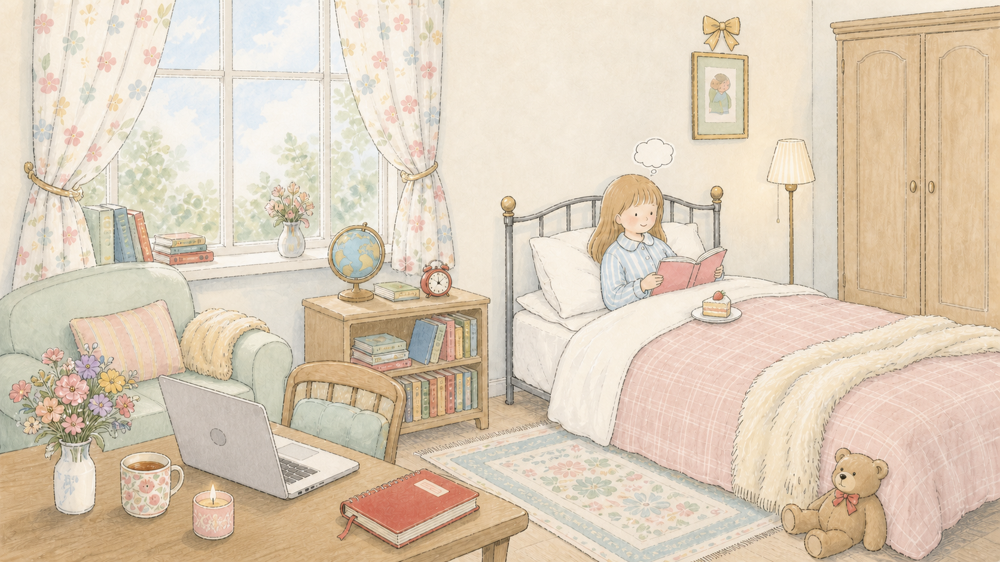

<html lang="zh-CN">
<head>
    <meta charset="UTF-8">
    <meta name="viewport" content="width=device-width, initial-scale=1.0">
    <title>Ariel's Personal Website</title>
    <link rel="stylesheet" href="https://cdnjs.cloudflare.com/ajax/libs/font-awesome/6.4.0/css/all.min.css">
    
</head>
<body>
    <!-- 加载动画 -->
    

        <h1 class="loading-title">Welcome to Ariel's World</h1>
        

            

        

        

            🎂
            🌟
            🧚‍♀️
            🥰
            🫧
        

        <button id="enterButton" class="enter-button">ENTER</button>
    

    <!-- 背景音乐播放器 -->
    <audio id="bgmPlayer" src="花日马林巴.mp3" loop></audio>
    <button id="musicControl" class="music-control" style="display: none;">
        <i id="musicIcon" class="fas fa-volume-up"></i>
    </button>

    <!-- 首页 - 房间 -->
    

        

            
            

                

                    
                    
                

                
                
                

                    
                    
                    
                

                
            

            
            

                欢迎来到Ariel的房间，试试看点击不同的物件吧~ ✨
            

            <!-- 热点1：红色笔记本 -> 小红书笔记 -->
            

                <button class="hotspot-btn" onclick="showPage('xiaohongshu')">📕 小红书笔记</button>
            

            <!-- 热点2：床上的小蛋糕 -> 美食分享 -->
            

                <button class="hotspot-btn" onclick="showPage('food')">🍰 美食分享</button>
            

            <!-- 热点3：桌上的香薰蜡烛 -> 手工作品 -->
            

                <button class="hotspot-btn" onclick="showPage('handmade')">🕯️ 手工作品</button>
            

            <!-- 热点4：床边书架 -> 语言学习 -->
            

                <button class="hotspot-btn" onclick="showPage('language')">📖 语言学习</button>
            

            <!-- 热点5：地球仪 -> 探索世界 -->
            

                <button class="hotspot-btn" onclick="showPage('travel')">🌍 探索世界</button>
            

            <!-- 热点6：电脑 -> 项目经历 -->
            

                <button class="hotspot-btn" onclick="showPage('projects')">💻 项目经历</button>
            

            <!-- 热点7：女孩和思考云 -> 碎碎念 -->
            

                <button class="hotspot-btn" onclick="showPage('thoughts')">💭 碎碎念</button>
            

        

    

    <!-- 语言学习页面 -->
    

        

            
← 回到房间

            <h1>📖 语言学习</h1>
            
法语TCF C1 | 雅思7.5 | 终身学习者

        

        
        <main class="section">
            

                

                    
🇫🇷

                    
FR

                    <h3>法语学习</h3>
                    TCF C1
                    
专业学习四年，热爱法语文化

                

                

                    
🇬🇧

                    
GB

                    <h3>英语学习</h3>
                    雅思7.5
                    
日常交流无障碍，阅读能力优秀

                

                

                    
🇨🇳

                    
CN

                    <h3>中文思考</h3>
                    母语
                    
写作表达能力突出

                

            

        </main>

        <footer>
            Made with 💕 by Ariel | © 2026
        </footer>
    

    <!-- 项目经历页面 -->
    

        

            
← 回到房间

            <h1>💼 项目经历</h1>
            
产品经理实习经历

        

        
        <main class="section">
            

                

                    

                        <h3>美团推广通/智选展位产品</h3>
                        
2025.12 - 2026.03

                        
<strong>部门</strong>：本地核心商业-商业化增值部 
                        <strong>项目背景</strong>：医美行业夜间咨询量占比28%，客单价较高但商户客服未能承接。 
                        <strong>核心方案</strong>：开发夜间留咨机器人，在推广通页面新增宣传位，按CPS计费。 
                        <strong>技术实现</strong>：采用RAG技术搭建知识库，限制输出80字以内。 
                        <strong>项目结果</strong>：夜间广告收入增长67%，商户ROI提升13.5%。

                    

                

                

                    

                        <h3>百度AI品专广告（百事通）</h3>
                        
2024.12 - 2025.02

                        
<strong>部门</strong>：商业产品部 
                        <strong>项目背景</strong>：传统品专广告投放效率低、效果差、体验不达标。 
                        <strong>核心方案</strong>：引入AIGC驱动创意优选，构建品牌资产库。 
                        <strong>技术实现</strong>：调用百度擎舵生成素材，建立质量打分和排序逻辑。 
                        <strong>项目结果</strong>：点击率+10%，转化率+8%，年覆盖收入3亿元。

                    

                

            

        </main>

        <footer>
            Made with 💕 by Ariel | © 2026
        </footer>
    

    <!-- 探索世界页面 -->
    

        

            
← 回到房间

            <h1>🌍 探索世界</h1>
            
旅行记忆与美好瞬间

        

        
        <main class="section">
            

                

                    

                        
                        
→

                        
1/3

                    

                    

                        <h3>🇫🇷 巴黎</h3>
                        
浪漫之都，埃菲尔铁塔、卢浮宫、塞纳河畔...

                    

                    

                        
                        
                        
                    

                

                

                    

                        
                        
→

                        
1/2

                    

                    

                        <h3>🇫🇷 尼斯</h3>
                        
蔚蓝海岸，阳光沙滩，地中海风情

                    

                    

                        
                        
                    

                

                

                    

                        
                        
→

                        
1/3

                    

                    

                        <h3>🇪🇸 巴塞罗那</h3>
                        
高迪的建筑艺术，地中海畔的热情城市

                    

                    

                        
                        
                        
                    

                

                

                    

                        
                        
→

                        
1/2

                    

                    

                        <h3>🇮🇹 意大利</h3>
                        
米兰大教堂充满圣经故事，想要天天吃gelato！🍦

                    

                    

                        
                        
                    

                

                

                    

                        
                        
→

                        
1/2

                    

                    

                        <h3>🇲🇨 摩纳哥</h3>
                        
满街豪车，参观摩纳哥王宫，感受奢华之都的魅力

                    

                    

                        
                        
                    

                

                

                    

                        
                        
→

                        
1/2

                    

                    

                        <h3>🇫🇷 图卢兹</h3>
                        
玫瑰之城，航空航天的重镇

                    

                    

                        
                        
                    

                

                

                    

                        
                        
→

                        
1/2

                    

                    

                        <h3>🇧🇪 比利时</h3>
                        
巧克力与华夫饼的国度

                    

                    

                        
                        
                    

                

            

        </main>

        <footer>
            Made with 💕 by Ariel | © 2026
        </footer>
    

    <!-- 碎碎念页面 -->
    

        

            
← 回到房间

            <h1>💭 Ariel的碎碎念</h1>
            
日常思考与感悟

        

        
        <main class="section">
            

                

                

                    <h3>分享你的想法 ✨</h3>
                    <form onsubmit="addThought(event)">
                        <textarea id="thoughtInput" placeholder="写下你的想法..."></textarea>
                         
                        <button type="submit" class="btn-primary">发布</button>
                    </form>
                

            

        </main>

        <footer>
            Made with 💕 by Ariel | © 2026
        </footer>
    

    <!-- 留言板页面 -->
    

        

            
← 回到房间

            <h1>📬 留言板</h1>
            
留下你的足迹

        

        
        <main class="section">
            

                <form class="message-form" id="messageForm">
                    <input type="text" id="nameInput" placeholder="你的名字" required>
                    <textarea id="messageInput" placeholder="写下你想说的话..." rows="4" required></textarea>
                    <button type="submit">发送留言</button>
                </form>
                

            

        </main>

        <footer>
            Made with 💕 by Ariel | © 2026
        </footer>
    

    <!-- 法语笔记页面 -->
    

        

            
← 返回语言学习

            <h1>🇫🇷 法语学习笔记</h1>
            
法语TCF C1水平

        

        
        <main class="section">
            

            

                <h3>添加法语笔记 ✏️</h3>
                <form onsubmit="addFrenchNote(event)">
                    

                        <label for="frenchTitle">标题</label>
                        <input type="text" id="frenchTitle" placeholder="笔记标题">
                    

                    

                        <label for="frenchContent">内容</label>
                        <textarea id="frenchContent" placeholder="笔记内容"></textarea>
                    

                    <button type="submit" class="btn-primary">保存笔记</button>
                </form>
            

        </main>

        <footer>
            Made with 💕 by Ariel | © 2026
        </footer>
    

    <!-- 英语笔记页面 -->
    

        

            
← 返回语言学习

            <h1>🇬🇧 英语学习笔记</h1>
            
雅思7.5

        

        
        <main class="section">
            

            

                <h3>添加英语笔记 ✏️</h3>
                <form onsubmit="addEnglishNote(event)">
                    

                        <label for="englishTitle">标题</label>
                        <input type="text" id="englishTitle" placeholder="笔记标题">
                    

                    

                        <label for="englishContent">内容</label>
                        <textarea id="englishContent" placeholder="笔记内容"></textarea>
                    

                    <button type="submit" class="btn-primary">保存笔记</button>
                </form>
            

        </main>

        <footer>
            Made with 💕 by Ariel | © 2026
        </footer>
    

    <!-- 中文笔记页面 -->
    

        

            
← 返回语言学习

            <h1>🇨🇳 中文思考笔记</h1>
            
母语水平

        

        
        <main class="section">
            

            

                <h3>添加中文笔记 ✏️</h3>
                <form onsubmit="addChineseNote(event)">
                    

                        <label for="chineseTitle">标题</label>
                        <input type="text" id="chineseTitle" placeholder="笔记标题">
                    

                    

                        <label for="chineseContent">内容</label>
                        <textarea id="chineseContent" placeholder="笔记内容"></textarea>
                    

                    <button type="submit" class="btn-primary">保存笔记</button>
                </form>
            

        </main>

        <footer>
            Made with 💕 by Ariel | © 2026
        </footer>
    

    <!-- 手工作品页面 -->
    

        

            
← 回到房间

            <h1>🧶 手工作品</h1>
            
DIY手工制作

        

        
        <main class="section">
            

            

                <h3>分享手工作品 ✏️</h3>
                <form onsubmit="addHandmadeNote(event)">
                    

                        <label for="handmadeTitle">作品名称</label>
                        <input type="text" id="handmadeTitle" placeholder="作品名称">
                    

                    

                        <label for="handmadeContent">作品描述</label>
                        <textarea id="handmadeContent" placeholder="描述你的作品"></textarea>
                    

                    <button type="submit" class="btn-primary">保存作品</button>
                </form>
            

        </main>

        <footer>
            Made with 💕 by Ariel | © 2026
        </footer>
    

    <!-- 美食分享页面 -->
    

        

            
← 回到房间

            <h1>🍰 美食分享</h1>
            
美食探索与烹饪分享

        

        
        <main class="section">
            

            

                <h3>分享美食 ✏️</h3>
                <form onsubmit="addFoodNote(event)">
                    

                        <label for="foodTitle">美食名称</label>
                        <input type="text" id="foodTitle" placeholder="美食名称">
                    

                    

                        <label for="foodContent">美食描述</label>
                        <textarea id="foodContent" placeholder="描述这道美食"></textarea>
                    

                    <button type="submit" class="btn-primary">保存美食</button>
                </form>
            

        </main>

        <footer>
            Made with 💕 by Ariel | © 2026
        </footer>
    

    <!-- 小红书笔记页面 -->
    

        

            
← 回到房间

            <h1>📕 小红书笔记</h1>
            
记录生活点滴

        

        
        <main class="section">
            

            

                <h3>发布小红书笔记 ✏️</h3>
                <form onsubmit="addXiaohongshuNote(event)">
                    

                        <label for="xiaohongshuTitle">笔记标题</label>
                        <input type="text" id="xiaohongshuTitle" placeholder="笔记标题">
                    

                    

                        <label for="xiaohongshuContent">笔记内容</label>
                        <textarea id="xiaohongshuContent" placeholder="写下你的笔记内容"></textarea>
                    

                    <button type="submit" class="btn-xiaohongshu">发布笔记</button>
                </form>
            

        </main>

        <footer>
            Made with 💕 by Ariel | © 2026
        </footer>
    

    
</body>
</html>
