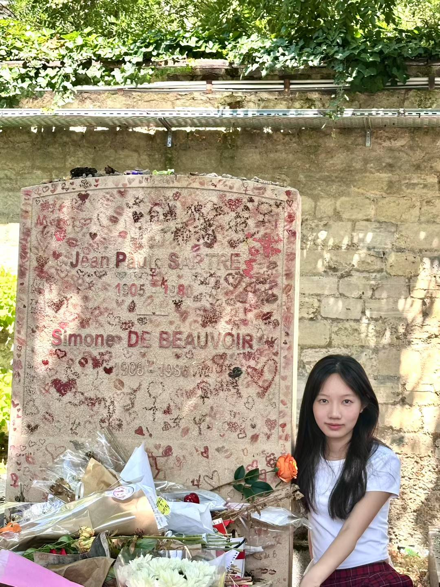
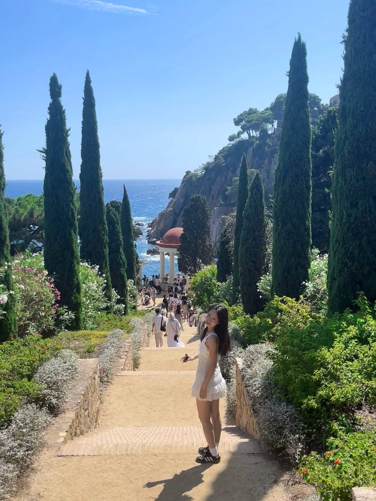
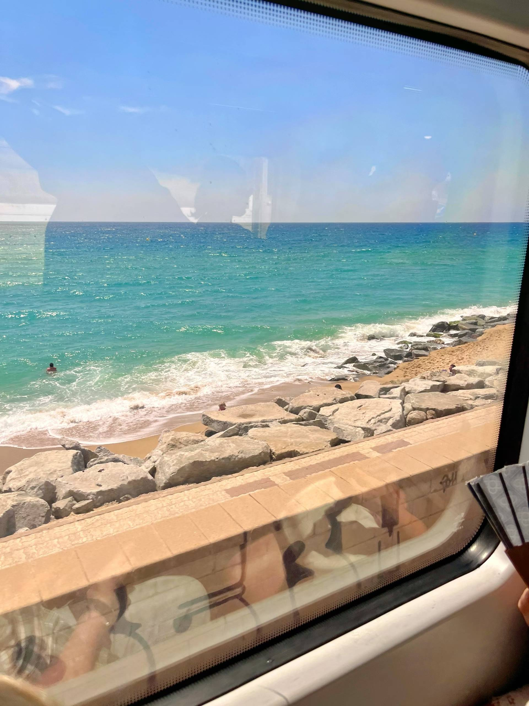
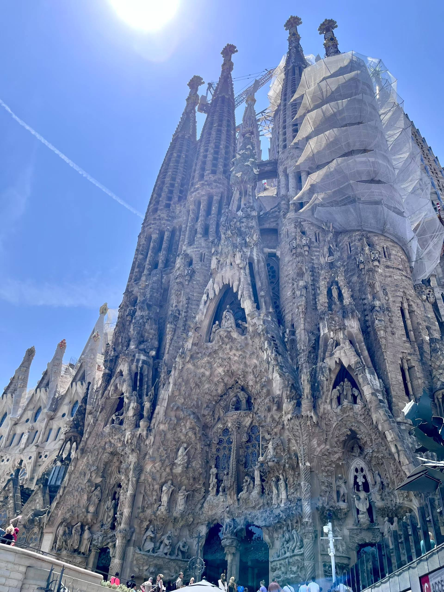
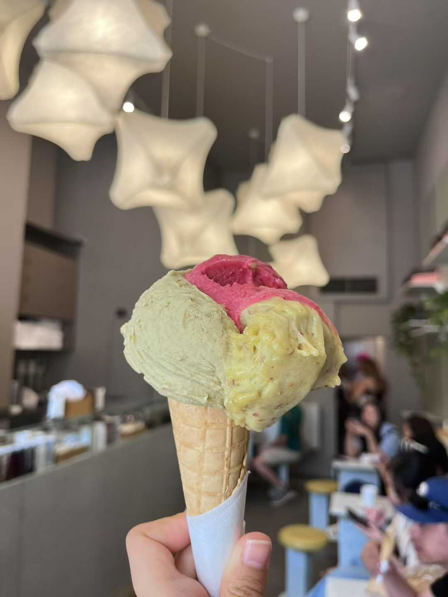
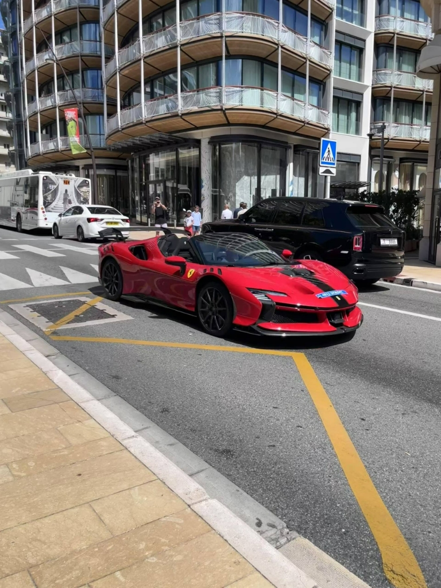
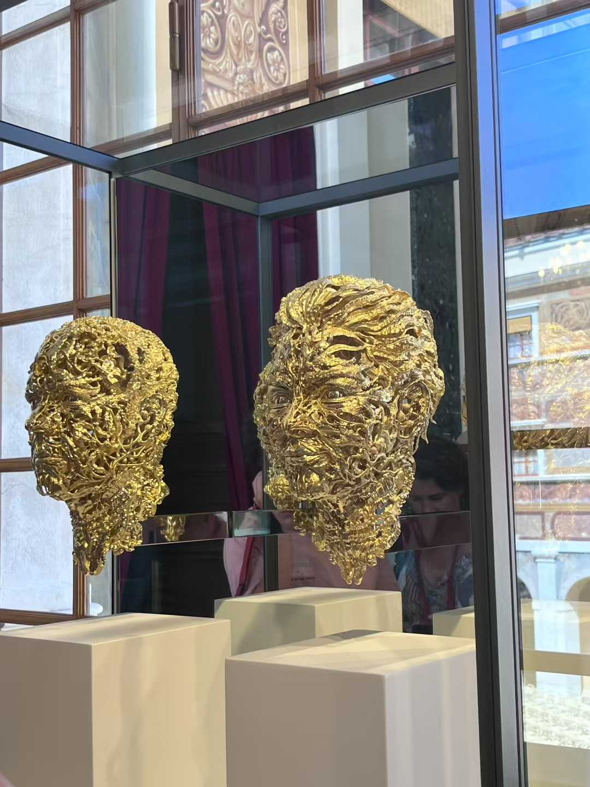
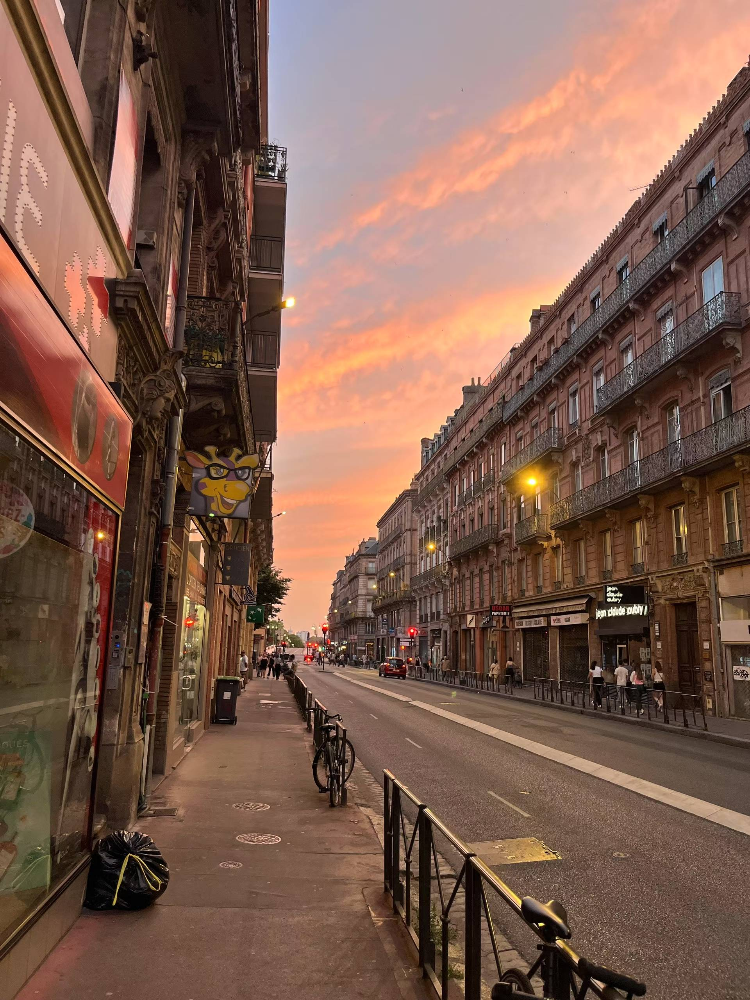
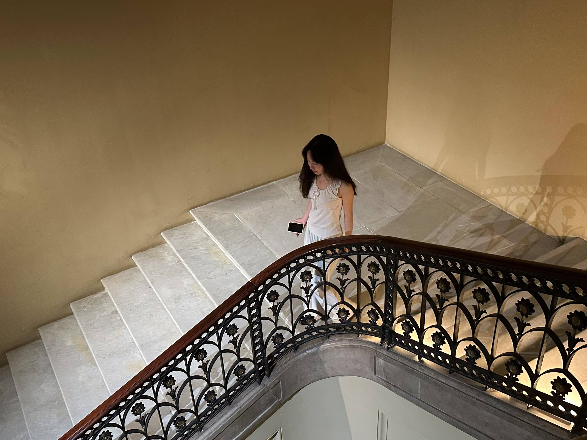
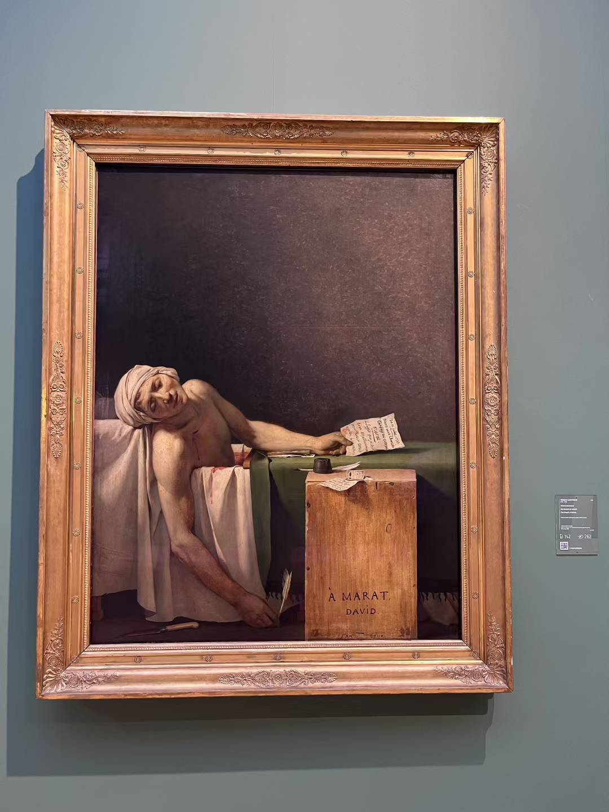

<!DOCTYPE html>
<html lang="zh-CN">
<head>
    <meta charset="UTF-8">
    <meta name="viewport" content="width=device-width, initial-scale=1.0">
    <title>Ariel's Personal Website</title>
    <link rel="stylesheet" href="https://cdnjs.cloudflare.com/ajax/libs/font-awesome/6.4.0/css/all.min.css">
    
</head>
<body>
    <!-- 加载动画 -->
    

        <h1 class="loading-title">Welcome to Ariel's World</h1>
        

            

        

        

            🎂
            🌟
            🧚‍♀️
            🥰
            🫧
        

        <button id="enterButton" class="enter-button">ENTER</button>
    

    <nav>
        

            
Ariel's World

            
<i class="fas fa-bars"></i>

            <ul class="nav-links" id="navLinks">
                <li><a onclick="showPage('home')">🏠 首页</a></li>
                <li><a onclick="showPage('home')">📖 语言学习</a></li>
                <li><a onclick="showPage('home')">💼 项目经历</a></li>
                <li><a onclick="showPage('home')">🌍 探索世界</a></li>
                <li><a onclick="showPage('home')">🎨 个人作品</a></li>
                <li><a onclick="showPage('home')">💭 碎碎念</a></li>
                <li><a onclick="showPage('home')">📬 留言板</a></li>
            </ul>
        

    </nav>

    <!-- 首页 -->
    

        <section class="hero">
            

                
            

            <h1>成长中的法专生·Ariel</h1>
            
湖南师范大学外国语言文学专业 | 法语TCF C1 | 雅思7.5 | 自媒体博主

            

                🌍 语言爱好者
                📚 终身学习
                🎬 内容创作
            

        </section>

        <section id="language" class="section">
            <h2 class="section-title">📖 语言学习</h2>
            

                

                    
🇫🇷

                    
FR

                    <h3>法语学习</h3>
                    TCF C1
                    
专业学习四年，热爱法语文化

                

                

                    
🇬🇧

                    
GB

                    <h3>英语学习</h3>
                    雅思7.5
                    
日常交流无障碍，阅读能力优秀

                

                

                    
🇨🇳

                    
CN

                    <h3>中文思考</h3>
                    母语
                    
写作表达能力突出

                

            

        </section>

        <section id="projects" class="section">
            <h2 class="section-title">💼 项目经历</h2>
            

                

                    

                        <h3>美团推广通/智选展位产品</h3>
                        
2025.12 - 2026.03

                        
<strong>部门</strong>：本地核心商业-商业化增值部 
                        <strong>项目背景</strong>：医美行业夜间咨询量占比28%，客单价较高但商户客服未能承接。 
                        <strong>核心方案</strong>：开发夜间留咨机器人，在推广通页面新增宣传位，按CPS计费。 
                        <strong>技术实现</strong>：采用RAG技术搭建知识库，限制输出80字以内。 
                        <strong>项目结果</strong>：夜间广告收入增长67%，商户ROI提升13.5%。

                    

                

                

                    

                        <h3>百度AI品专广告（百事通）</h3>
                        
2024.12 - 2025.02

                        
<strong>部门</strong>：商业产品部 
                        <strong>项目背景</strong>：传统品专广告投放效率低、效果差、体验不达标。 
                        <strong>核心方案</strong>：引入AIGC驱动创意优选，构建品牌资产库。 
                        <strong>技术实现</strong>：调用百度擎舵生成素材，建立质量打分和排序逻辑。 
                        <strong>项目结果</strong>：点击率+10%，转化率+8%，年覆盖收入3亿元。

                    

                

            

        </section>

        <section id="travel" class="section">
            <h2 class="section-title">🌍 探索世界</h2>
            

                

                    

                        
                        
→

                        
1/3

                    

                    

                        <h3>🇫🇷 巴黎</h3>
                        
浪漫之都，埃菲尔铁塔、卢浮宫、塞纳河畔...

                    

                    

                        
                        
                        
                    

                

                

                    

                        
                        
→

                        
1/2

                    

                    

                        <h3>🇫🇷 尼斯</h3>
                        
蔚蓝海岸，阳光沙滩，地中海风情

                    

                    

                        
                        
                    

                

                

                    

                        
                        
→

                        
1/3

                    

                    

                        <h3>🇪🇸 巴塞罗那</h3>
                        
高迪的建筑艺术，地中海畔的热情城市

                    

                    

                        
                        
                        
                    

                

                

                    

                        
                        
→

                        
1/2

                    

                    

                        <h3>🇮🇹 意大利</h3>
                        
米兰大教堂充满圣经故事，想要天天吃gelato！🍦

                    

                    

                        
                        
                    

                

                

                    

                        
                        
→

                        
1/2

                    

                    

                        <h3>🇲🇨 摩纳哥</h3>
                        
满街豪车，参观摩纳哥王宫，感受奢华之都的魅力

                    

                    

                        
                        
                    

                

                

                    

                        
                        
→

                        
1/2

                    

                    

                        <h3>🇫🇷 图卢兹</h3>
                        
玫瑰之城，航空航天的重镇

                    

                    

                        
                        
                    

                

                

                    

                        
                        
→

                        
1/2

                    

                    

                        <h3>🇧🇪 比利时</h3>
                        
巧克力与华夫饼的国度

                    

                    

                        
                        
                    

                

            

        </section>

        <section id="works" class="section">
            <h2 class="section-title">🎨 个人作品</h2>
            

                

                    
📕

                    <h3>小红书笔记</h3>
                    
记录法语学习与生活点滴

                

                

                    
✂️

                    <h3>手工作品</h3>
                    
创意手工与艺术创作

                

                

                    
🍳

                    <h3>美食分享</h3>
                    
美食探店与烹饪心得

                

            

        </section>

        <section id="thoughts" class="section">
            <h2 class="section-title">💭 Ariel的碎碎念</h2>
            

                

                

                    <h3>分享你的想法 ✨</h3>
                    <form onsubmit="addThought(event)">
                        <textarea id="newThought" placeholder="在这里写下你的碎碎念..." required></textarea>
                        <button type="submit" class="btn-primary" style="margin-top: 1rem; width: 100%;">发布</button>
                    </form>
                

            

        </section>

        <section id="messages" class="section">
            <h2 class="section-title">📬 留言板</h2>
            

                

                    <h3 style="margin-bottom: 1.5rem; color: var(--primary-dark);">留下你的足迹 ✨</h3>
                    <form onsubmit="addMessage(event)">
                        <input type="text" id="visitorName" placeholder="你的名字" required>
                        <textarea id="visitorMessage" placeholder="想对我说的话..." required></textarea>
                        <button type="submit" class="btn-primary">发送留言</button>
                    </form>
                

                

            

        </section>

        <footer>
            
Made with 💕 by Ariel | © 2024

        </footer>
    

    <!-- 法语学习页面 -->
    

        

            
← 返回首页

            <h1>🇫🇷 法语学习</h1>
            
专业学习四年 | TCF C1 | 热爱法语文化

        

        
        <main class="section">
            <h2 class="section-title">📝 我的法语笔记</h2>
            
            

            
            

                <h3>➕ 添加新笔记</h3>
                <form onsubmit="addFrenchNote(event)">
                    

                        <label for="frenchNoteTitle">标题</label>
                        <input type="text" id="frenchNoteTitle" placeholder="请输入笔记标题" required>
                    

                    

                        <label for="frenchNoteContent">内容</label>
                        <textarea id="frenchNoteContent" placeholder="请输入笔记内容" required></textarea>
                    

                    <button type="submit" class="btn-primary">保存笔记</button>
                </form>
            

        </main>
        
        

            
© 2024 Ariel. All rights reserved.

        

    

    <!-- 英语学习页面 -->
    

        

            
← 返回首页

            <h1>🇬🇧 英语学习</h1>
            
日常交流无障碍 | 阅读能力优秀

        

        
        <main class="section">
            <h2 class="section-title">📝 我的英语笔记</h2>
            
            

            
            

                <h3>➕ 添加新笔记</h3>
                <form onsubmit="addEnglishNote(event)">
                    

                        <label for="englishNoteTitle">标题</label>
                        <input type="text" id="englishNoteTitle" placeholder="请输入笔记标题" required>
                    

                    

                        <label for="englishNoteContent">内容</label>
                        <textarea id="englishNoteContent" placeholder="请输入笔记内容" required></textarea>
                    

                    <button type="submit" class="btn-primary">保存笔记</button>
                </form>
            

        </main>
        
        

            
© 2024 Ariel. All rights reserved.

        

    

    <!-- 中文思考页面 -->
    

        

            
← 返回首页

            <h1>🇨🇳 中文思考</h1>
            
母语 | 写作表达能力突出

        

        
        <main class="section">
            <h2 class="section-title">📝 我的中文笔记</h2>
            
            

            
            

                <h3>➕ 添加新笔记</h3>
                <form onsubmit="addChineseNote(event)">
                    

                        <label for="chineseNoteTitle">标题</label>
                        <input type="text" id="chineseNoteTitle" placeholder="请输入笔记标题" required>
                    

                    

                        <label for="chineseNoteContent">内容</label>
                        <textarea id="chineseNoteContent" placeholder="请输入笔记内容" required></textarea>
                    

                    <button type="submit" class="btn-primary">保存笔记</button>
                </form>
            

        </main>
        
        

            
© 2024 Ariel. All rights reserved.

        

    

    <!-- 小红书笔记页面 -->
    

        

            
← 返回首页

            <h1>📕 小红书笔记</h1>
            
记录法语学习与生活点滴

        

        
        <main class="section">
            <h2 class="section-title">📝 我的笔记</h2>
            
            

            
            

                <a href="https://xhslink.com/m/7A5AjuXwBSB" target="_blank" class="btn-xiaohongshu">📕 去小红书上查看更多</a>
            

            
            

                <h3>➕ 添加新笔记</h3>
                <form onsubmit="addXiaohongshuNote(event)">
                    

                        <label for="xiaohongshuNoteTitle">标题</label>
                        <input type="text" id="xiaohongshuNoteTitle" placeholder="请输入笔记标题" required>
                    

                    

                        <label for="xiaohongshuNoteContent">内容</label>
                        <textarea id="xiaohongshuNoteContent" placeholder="请输入笔记内容"></textarea>
                    

                    

                        <label for="xiaohongshuNoteImage">图片URL（可选）</label>
                        <input type="text" id="xiaohongshuNoteImage" placeholder="请输入图片URL">
                    

                    <button type="submit" class="btn-primary">保存笔记</button>
                </form>
            

        </main>
        
        

            
© 2024 Ariel. All rights reserved.

        

    

    <!-- 手工作品页面 -->
    

        

            
← 返回首页

            <h1>✂️ 手工作品</h1>
            
创意手工与艺术创作

        

        
        <main class="section">
            <h2 class="section-title">✂️ 我的手工作品</h2>
            
            

            
            

                <h3>➕ 添加新作品</h3>
                <form onsubmit="addHandmadeNote(event)">
                    

                        <label for="handmadeNoteTitle">标题</label>
                        <input type="text" id="handmadeNoteTitle" placeholder="请输入作品标题" required>
                    

                    

                        <label for="handmadeNoteContent">内容</label>
                        <textarea id="handmadeNoteContent" placeholder="请输入作品描述"></textarea>
                    

                    

                        <label for="handmadeNoteImage">图片URL（可选）</label>
                        <input type="text" id="handmadeNoteImage" placeholder="请输入图片URL">
                    

                    <button type="submit" class="btn-primary">保存作品</button>
                </form>
            

        </main>
        
        

            
© 2024 Ariel. All rights reserved.

        

    

    <!-- 美食分享页面 -->
    

        

            
← 返回首页

            <h1>🍳 美食分享</h1>
            
美食探店与烹饪心得

        

        
        <main class="section">
            <h2 class="section-title">🍳 我的美食分享</h2>
            
            

            
            

                <h3>➕ 添加新分享</h3>
                <form onsubmit="addFoodNote(event)">
                    

                        <label for="foodNoteTitle">标题</label>
                        <input type="text" id="foodNoteTitle" placeholder="请输入美食标题" required>
                    

                    

                        <label for="foodNoteContent">内容</label>
                        <textarea id="foodNoteContent" placeholder="请输入美食描述"></textarea>
                    

                    

                        <label for="foodNoteImage">图片URL（可选）</label>
                        <input type="text" id="foodNoteImage" placeholder="请输入图片URL">
                    

                    <button type="submit" class="btn-primary">保存分享</button>
                </form>
            

        </main>
        
        

            
© 2024 Ariel. All rights reserved.

        

    

    
</body>
</html>
